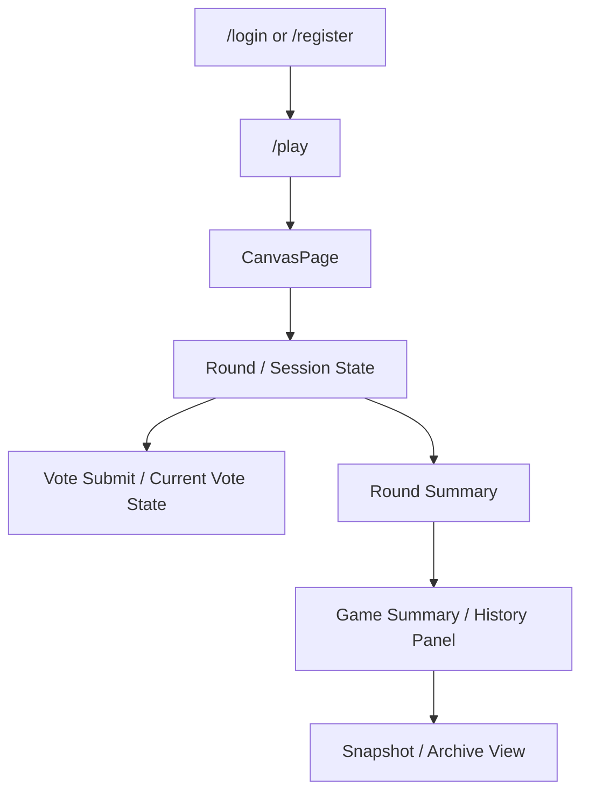

# Data Flow

## 역할
이 문서는 사용자 화면과 backend 상태가 어떤 순서로 이어지는지 설명한다.  
코드 위치보다 흐름 자체를 먼저 파악해야 할 때 이 문서를 기준으로 본다.

## 기준
- 코드 기준선: `main@31d22b3535627b3a0a56ea1cf9e41411475f72fd`
- 구조 사실 근거: [[wiki/05-Sources/repos/votedots-overview|votedots-overview]]

## 핵심 흐름 개요
1. 인증 후 `/play`로 진입한다.
2. 플레이 화면에서 canvas / round / session 상태를 함께 본다.
3. 사용자는 라운드 상태에 따라 투표하거나 결과를 기다린다.
4. 라운드 종료 후 summary와 history 흐름으로 결과를 다시 조회한다.

## 사용자 흐름

## 계층별 역할
| 계층 | 역할 | 주요 경로 |
| --- | --- | --- |
| Router / Page | `/login`, `/register`, `/play` 진입과 CanvasPage 연결 | `frontend/src/app/router.tsx`, `frontend/src/pages/canvas/*` |
| Gameplay UI | canvas, round, vote, history, session 상태를 화면에 조합 | `frontend/src/features/gameplay/*` |
| API / Realtime | 인증, canvas, round, vote, summary/history 조회와 상태 전파 | `backend/src/index.ts`, `backend/src/modules/*` |
| Storage / Infra | DB, Redis session, snapshot storage | `backend/src/database/*`, `backend/src/config/session.ts`, `backend/src/modules/history/*` |

## 흐름 1. 인증과 플레이 진입
| 단계 | 설명 |
| --- | --- |
| 인증 | 사용자는 로그인/회원가입 후 세션 기준으로 접근한다. |
| 라우팅 | Router는 `/login`, `/register`, `/play`를 기준 진입점으로 둔다. |
| 진입 후 상태 초기화 | `/play`에서 gameplay bootstrap과 phase 기반 화면 흐름이 시작된다. |

관련 문서:
- [[wiki/04-Records/Worklog/WK-2026-04-11-01-play-entry-and-phase-flow|WK-2026-04-11-01]]
- [[wiki/02-Architecture/System-Reference|System Reference]]
- [[wiki/05-Sources/repos/votedots-auth-play|votedots-auth-play]]

## 흐름 2. canvas / round / vote
| 단계 | 설명 |
| --- | --- |
| canvas 조회 | frontend는 canvas 상태와 체크 범위를 기준으로 화면을 구성한다. |
| round 상태 확인 | round 상태와 타이머, session bootstrap이 함께 반영된다. |
| vote 제출 | 사용자는 현재 round 기준으로 vote를 제출하고, 현재 투표 상태를 다시 조회한다. |
| 대형 canvas 대응 | 큰 화면에서는 sparse grid + chunk 렌더링 방향이 이미 적용되어 있다. |

관련 문서:
- [[wiki/04-Records/Issues/ISS-001-large-canvas-full-grid-bottleneck|ISS-001]]
- [[wiki/04-Records/Decisions/DEC-001-sparse-grid-and-chunk-rendering|DEC-001]]
- [[wiki/05-Sources/prs/PR-233-sparse-grid-chunk-rendering|PR-233]]
- [[wiki/05-Sources/repos/votedots-canvas|votedots-canvas]]
- [[wiki/05-Sources/repos/votedots-round-vote|votedots-round-vote]]

## 흐름 3. summary / history / snapshot
| 단계 | 설명 |
| --- | --- |
| round summary | round 종료 후 결과 요약을 조회한다. |
| game summary | 게임 단위 요약과 결과 조회가 이어진다. |
| history panel | history panel에서 intro/round/history 흐름을 다시 탐색한다. |
| snapshot archive | 저장된 snapshot 경로를 기준으로 결과 이미지를 다시 연다. |

관련 문서:
- [[wiki/04-Records/Decisions/DEC-002-summary-ready-event-and-snapshot-flow|DEC-002]]
- [[wiki/05-Sources/prs/PR-201-summary-ready-flow|PR-201]]
- [[wiki/05-Sources/issues/ISSUE-206-game-history-panel-snapshot-archive|ISSUE-206]]
- [[wiki/05-Sources/issues/ISSUE-234-history-panel-timeline|ISSUE-234]]
- [[wiki/05-Sources/repos/votedots-history-summary|votedots-history-summary]]

## 현재 남아 있는 흐름 gap
| 영역 | 현재 상태 | 다음 문서 |
| --- | --- | --- |
| history panel timeline | intro 고정과 최신순 타임라인 UX가 남아 있다. | [[wiki/03-Status/Next-Work|Next Work]] |
| templateKey / profileKey 기준 | template 용어와 실제 구현 기준 정렬이 남아 있다. | [[wiki/03-Status/Next-Work|Next Work]] |
| smoke test 기준 | auth -> play -> round active -> vote submit 흐름의 회귀 기준 정리가 남아 있다. | [[wiki/03-Status/Next-Work|Next Work]] |

## 같이 볼 문서
- 구조 기준: [[wiki/02-Architecture/System-Reference|System Reference]]
- 운영 구조: [[wiki/02-Architecture/Operations|Operations]]
- 현재 상태: [[wiki/03-Status/Current-State|Current State]]
- 작업/문제/결정 기록: [[wiki/04-Records/README|04-Records]]
