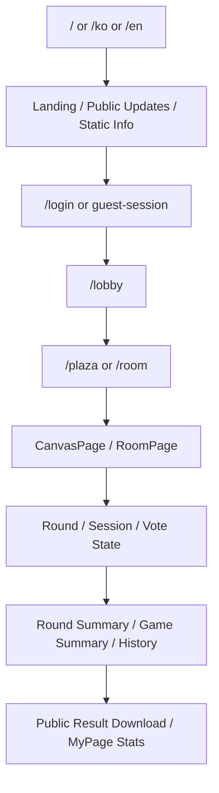

# Data Flow

## 역할
이 문서는 사용자 화면과 backend 상태가 어떤 순서로 이어지는지 설명한다.  
코드 위치보다 흐름 자체를 먼저 파악해야 할 때 이 문서를 기준으로 본다.

## 기준
- 코드 기준선: `main@ca5d4935b181dbd72e4895de5965b91ae7ae5d4a`
- 구조 사실 근거: [[wiki/05-Sources/repos/votedots-overview|votedots-overview]]

## 핵심 흐름 개요
1. 공개 사용자는 locale landing과 정적 페이지에서 현재 게임/완성 캔버스를 먼저 본다.
2. 사용자는 member 로그인 또는 guest 세션으로 lobby에 진입한다.
3. lobby에서 plaza 현재 게임 또는 특정 room으로 입장한다.
4. gameplay 화면에서 canvas / round / session / vote 상태를 함께 본다.
5. 라운드 종료 후 summary와 history, 공개 결과 이미지, mypage 기록 조회 흐름으로 이어진다.

## 사용자 흐름

```mermaid
flowchart TD
    A["/ or /ko or /en"] --> B["Landing / Public Updates / Static Info"]
    B --> C["/login or guest-session"]
    C --> D["/lobby"]
    D --> E["/plaza or /room"]
    E --> F["CanvasPage / RoomPage"]
    F --> G["Round / Session / Vote State"]
    G --> H["Round Summary / Game Summary / History"]
    H --> I["Public Result Download / MyPage Stats"]
```

## 계층별 역할
| 계층 | 역할 | 주요 경로 |
| --- | --- | --- |
| Router / Page | locale landing, auth, lobby/room, gameplay, mypage 진입을 연결한다. | `frontend/src/app/router.tsx`, `frontend/src/pages/*` |
| Public Surface | landing, completed preview, login board, static info를 구성한다. | `frontend/src/features/landing/*`, `frontend/src/features/login-board/*`, `backend/src/modules/public-*/*` |
| Lobby / Gameplay UI | lobby, room, canvas, round, vote, history, session 상태를 화면에 조합한다. | `frontend/src/features/lobby/*`, `frontend/src/features/room/*`, `frontend/src/features/gameplay/*` |
| API / Realtime | 인증, room, canvas, round, vote, summary/history, analytics를 처리한다. | `backend/src/app.ts`, `backend/src/modules/*`, `backend/src/socket/*` |
| Storage / Infra | DB, Redis session, snapshot storage, analytics rollup, test/deploy workflow를 구성한다. | `backend/src/database/*`, `backend/src/config/*`, `backend/src/scripts/*`, `.github/workflows/*` |

## 흐름 1. 공개 진입과 인증
| 단계 | 설명 |
| --- | --- |
| 공개 진입 | 사용자는 `/`, `/ko`, `/en`, patches/roadmap, 각종 정적 정보 페이지에서 서비스와 현재 상태를 먼저 본다. |
| 인증 | 사용자는 member 로그인/회원가입 또는 guest session 생성으로 접근한다. |
| 라우팅 | Router는 `/play`를 `/plaza`로 redirect하고, 실제 앱 진입은 `/lobby`, `/plaza`, `/room`, `/mypage`로 분기한다. |

관련 문서:
- [[wiki/02-Architecture/System-Reference|System Reference]]
- [[wiki/05-Sources/repos/votedots-auth-play|votedots-auth-play]]
- [[wiki/05-Sources/repos/votedots-public-surface|votedots-public-surface]]

## 흐름 2. lobby / plaza / room 선택
| 단계 | 설명 |
| --- | --- |
| lobby 조회 | 광장 현재 게임, 완성 캔버스, room list와 생성/입장 UI가 함께 노출된다. |
| room 선택 | 사용자는 공개 room에 바로 입장하거나 private access code를 해석해 들어간다. |
| room 관리 | member는 room 생성, 종료, 강제 종료를 수행할 수 있다. |
| 상태 동기화 | room list는 socket 이벤트와 연결되어 목록 refresh를 유도한다. |

관련 문서:
- [[wiki/05-Sources/repos/votedots-lobby-room|votedots-lobby-room]]
- [[wiki/05-Sources/repos/votedots-account-analytics|votedots-account-analytics]]

## 흐름 3. gameplay canvas / round / vote
| 단계 | 설명 |
| --- | --- |
| canvas 조회 | frontend는 canvas 상태와 체크 범위를 기준으로 화면을 구성한다. |
| round 상태 확인 | round 상태와 타이머, session bootstrap, phase sync가 함께 반영된다. |
| vote 제출 | 사용자는 현재 round 기준으로 vote를 제출하고 현재 투표 상태를 다시 조회한다. |
| 대형 canvas 대응 | 큰 화면과 모바일 모두 sparse grid + chunk 렌더링, 입력 보정, viewport 보호가 적용돼 있다. |

관련 문서:
- [[wiki/05-Sources/repos/votedots-canvas|votedots-canvas]]
- [[wiki/05-Sources/repos/votedots-round-vote|votedots-round-vote]]

## 흐름 4. summary / history / 공개 결과 / mypage
| 단계 | 설명 |
| --- | --- |
| round summary | round 종료 후 결과 요약을 조회한다. |
| game summary | 게임 단위 요약과 결과 조회가 이어진다. |
| history panel | history panel에서 intro/round/history 흐름을 다시 탐색한다. |
| 공개 결과 | completed canvas detail과 public final result 다운로드 흐름으로 이어진다. |
| mypage | member는 참여 기록 목록/상세와 통계를 별도 페이지에서 다시 조회한다. |

관련 문서:
- [[wiki/05-Sources/repos/votedots-history-summary|votedots-history-summary]]
- [[wiki/05-Sources/repos/votedots-public-surface|votedots-public-surface]]
- [[wiki/05-Sources/repos/votedots-account-analytics|votedots-account-analytics]]

## 현재 남아 있는 흐름 gap
| 영역 | 현재 상태 | 다음 문서 |
| --- | --- | --- |
| lobby / room 회귀 검증 | guest/member, public/private room, room lifecycle 분기 검증 정착이 남아 있다. | [[wiki/03-Status/Next-Work|Next Work]] |
| public surface 운영 검증 | completed preview / final result / static pages 자산 운영 검증이 남아 있다. | [[wiki/03-Status/Next-Work|Next Work]] |
| analytics / ops 검증 | visit rollup과 운영 fallback 절차 점검이 남아 있다. | [[wiki/03-Status/Next-Work|Next Work]] |
| templateKey / profileKey 기준 | template 용어와 실제 구현 기준 정렬이 남아 있다. | [[wiki/03-Status/Next-Work|Next Work]] |

## 같이 볼 문서
- 구조 기준: [[wiki/02-Architecture/System-Reference|System Reference]]
- 운영 구조: [[wiki/02-Architecture/Operations|Operations]]
- 현재 상태: [[wiki/03-Status/Current-State|Current State]]
- 작업/문제/결정 기록: [[wiki/04-Records/README|04-Records]]
